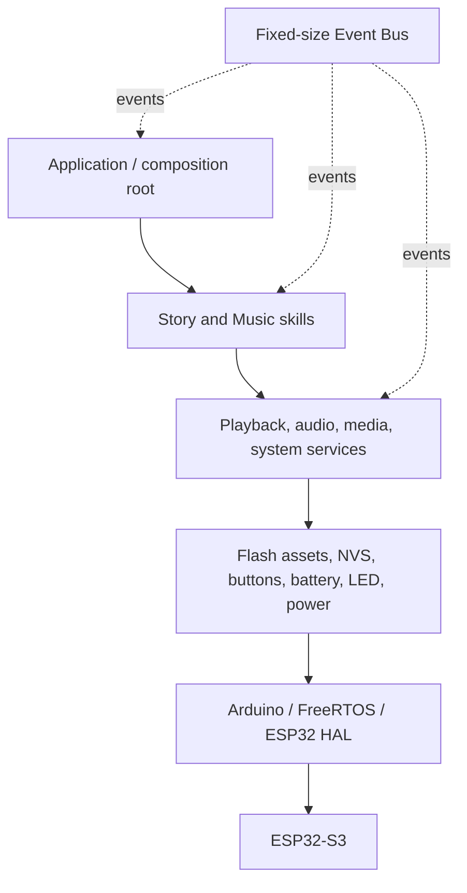
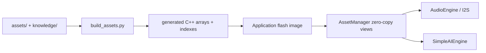

# Architecture

teni-core uses inward-facing interfaces so product behavior is independent of Arduino, ESP-IDF,
codec, and storage details.

`main.cpp` only starts the application task. `TeniApplication` is the composition root and owns all
objects in dependency order. No mutable global object is required. RAII releases queues, codecs,
files, and skills. Events are fixed-size values passed through a FreeRTOS queue; subscribers are
invoked only by the application task, avoiding re-entrant business logic.

## Boundaries

- Application: constructs dependencies, maps input events, schedules non-blocking service work.
- Services: embedded assets, SimpleAI, audio lifecycle, media catalog, playback coordination, power policy.
- Modules: product behavior packaged as `ISkill` implementations.
- Drivers: concrete adapters for SD, NVS, GPIO, ADC, LED, and power.
- HAL: Arduino/FreeRTOS/ESP32 APIs used only by concrete adapters.

Story and music never know about flash layout, FreeRTOS, or ESP32. `IAudioEngine` is the codec boundary;
adding AAC/FLAC requires decoder selection in the concrete engine, not changes to product modules.

## Skill extension

`SkillRegistry` owns `ISkill` instances and initializes/shuts them down uniformly. A future Animal,
Math, Learning, or Bedtime skill is added by implementing `ISkill`, subscribing to its events, and
registering it in the product composition root. Core modules remain unchanged. Static registration
is intentional on an MCU: it preserves plugin modularity without unsafe runtime-loaded binaries.

## Future AI boundaries

`IAIEngine` is the active inference boundary. `SimpleAIEngine` supplies deterministic offline intent
and knowledge behavior; replacing it with a future local LLM changes only composition. StorySkill,
MusicSkill, AssetManager, and the application contract remain stable. `FutureAiInterfaces.hpp` still
reserves wake word, speech recognition, TTS, memory, and knowledge-base boundaries.

## Embedded asset flow

## Concurrency

One pinned application task services button sampling, decoder work, system policy, and event
dispatch every 10 ms. The bus itself is thread-safe and can accept events from future microphone or
network tasks. Work is incremental: no Arduino `delay()`, blocking playback loop, or synchronous
wait occurs.
