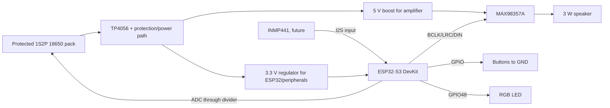

# Hardware wiring

## Electrical requirements

- TP4056 supports one lithium-ion series cell only. Two cells must be matched, same-age, protected,
  and wired as 1S2P by a qualified battery assembler. Never use TP4056 with a 2S pack.
- A bare TP4056 has no ideal load sharing. Use a proper power-path/load-sharing circuit if the toy
  must run while charging. Include fuse, cell protection, thermal validation, and a certified pack.
- The ADC input maximum is 3.3 V. Use a high-value divider sized for 4.2 V maximum and calibrate its
  measured ratio. Add a small capacitor at the ADC node.
- Power MAX98357A from a rail that meets the desired speaker output; share ground with ESP32. Keep
  speaker traces away from SD/I2S and place bulk decoupling close to the amplifier.
- MVP1.1 has no removable storage. All media and knowledge are part of the ESP32 flash image.
- INMP441 is reserved for a later milestone. Do not populate or enable it in MVP1.1 firmware.
