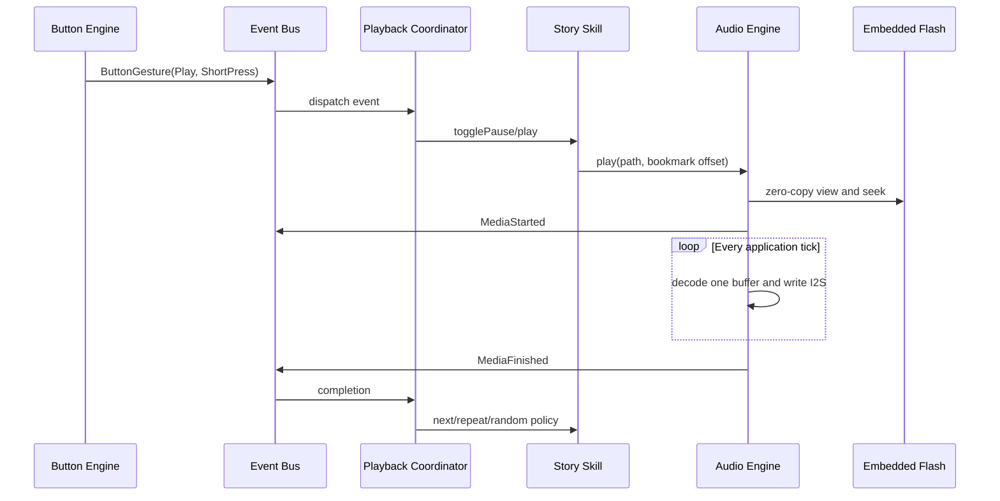

# Playback sequence

Bookmark writes are rate-limited to 30 seconds during playback and also occur at stop/shutdown.
NVS is the only writable persistent store; embedded assets are immutable until the next USB flash.
