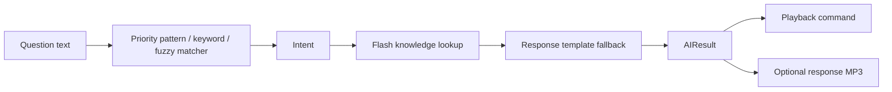

# SimpleAI engine

MVP1.1 uses deterministic local inference, not an LLM. `AIInteractionService` sends a question to
`IAIEngine`, executes control intents through `PlaybackCoordinator`, and plays a matching embedded
response recording when one exists.

Control intents have higher priority than knowledge topics. Fuzzy matching accepts a one-character
edit for keywords of at least four bytes. Knowledge answers are exact key matches within the detected
topic; supported arithmetic is intentionally limited to compiled examples. Unknown input returns a
fixed template, never fabricated text.

To add an answer, edit the corresponding `knowledge/*.json`. To add recorded speech, place files such
as `assets/responses/greeting.mp3`; text remains the fallback. Replacing the engine happens inside
`createAIEngine()`. Consumers continue using `IAIEngine` and `AIResult`.
