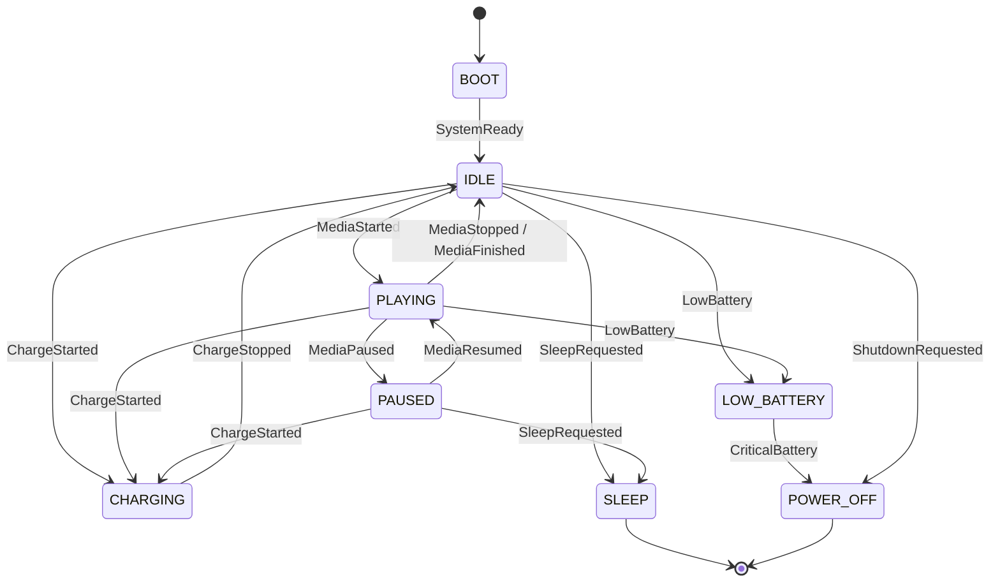

# Device state machine

Charging temporarily overlays the prior state; MVP1.1 returns to a safe idle if that state cannot be
restored. Deep sleep wakes from the play button. A physical load-switch latch is required for true
zero/near-zero shutdown; otherwise `POWER_OFF` falls back to deep sleep.
